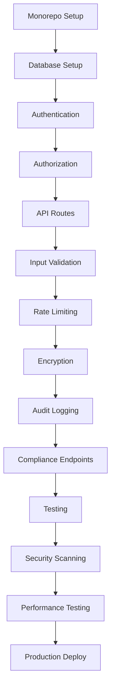

# Refleqt v2.0 - Security Architecture Implementation Roadmap
## From Prototype to Production-Hardened Platform

**Version:** 1.0
**Date:** December 30, 2025
**Current Status:** HTML Prototype → Production Platform
**Target Launch:** 26 weeks (6 months)

---

## Executive Summary

This roadmap transforms Refleqt from HTML prototypes into a production-ready, security-hardened platform with:
- **Distrust architecture** with zero-trust security model
- **Defense in depth** with 7+ security layers
- **Compliance-ready** for GDPR, CCPA, SOC2, PCI-DSS
- **Attack-resistant** against OWASP Top 10 + industry-specific threats
- **Truth-seeking** with audit trails and data provenance

---

## Table of Contents

1. [Current State Assessment](#current-state-assessment)
2. [Target Architecture](#target-architecture)
3. [Security Layers Overview](#security-layers-overview)
4. [Phase-by-Phase Implementation](#phase-by-phase-implementation)
5. [Technology Stack](#technology-stack)
6. [Critical Path Dependencies](#critical-path-dependencies)
7. [Risk Mitigation](#risk-mitigation)
8. [Success Criteria](#success-criteria)

---

## 1. Current State Assessment

### What Exists Today
```
refleqt-v2.0/
├── index.html              # Landing page prototype
├── portal.html             # Portal page prototype
└── pages/
    ├── onboarding.html         # User onboarding flow
    ├── intelligence-feed.html  # Intelligence feed UI
    ├── research-swarms.html    # Research swarms UI
    ├── strategy-cohorts.html   # Strategy cohorts UI
    ├── psychographics.html     # Psychographics UI
    ├── brewery.html            # Content generation UI
    └── pm-dashboard.html       # PM dashboard UI
```

### Security Posture: **0/100**
- ❌ No authentication
- ❌ No authorization
- ❌ No data persistence
- ❌ No API layer
- ❌ No encryption
- ❌ No input validation
- ❌ No logging
- ❌ No monitoring

### Gap Analysis
| Component | Current | Target | Gap |
|-----------|---------|--------|-----|
| Authentication | 0% | OAuth2 + MFA | 100% |
| Authorization | 0% | RBAC + ABAC | 100% |
| Data Encryption | 0% | AES-256 + TLS 1.3 | 100% |
| Input Validation | 0% | Zod + DOMPurify | 100% |
| Rate Limiting | 0% | Redis-based | 100% |
| Audit Logging | 0% | Comprehensive | 100% |
| Compliance | 0% | GDPR/SOC2/PCI | 100% |

---

## 2. Target Architecture

### Monorepo Structure
```
refleqt-v2.0/
├── apps/
│   ├── web/                        # Next.js 15 frontend
│   │   ├── src/
│   │   │   ├── app/                # App Router
│   │   │   │   ├── (auth)/         # Auth pages (login, signup)
│   │   │   │   ├── (portal)/       # Portal pages (authenticated)
│   │   │   │   │   ├── intelligence-feed/
│   │   │   │   │   ├── research-swarms/
│   │   │   │   │   ├── strategy-cohorts/
│   │   │   │   │   ├── psychographics/
│   │   │   │   │   ├── brewery/
│   │   │   │   │   └── dashboard/
│   │   │   │   └── api/            # Next.js API routes
│   │   │   │       ├── auth/       # NextAuth.js
│   │   │   │       └── trpc/       # tRPC endpoints
│   │   │   ├── components/         # React components
│   │   │   ├── hooks/              # Custom hooks
│   │   │   └── lib/                # Client utilities
│   │   ├── public/                 # Static assets
│   │   └── middleware.ts           # Auth + rate limiting
│   │
│   ├── api/                        # FastAPI backend (Python)
│   │   ├── src/
│   │   │   ├── routes/             # Modular API routes
│   │   │   │   ├── auth.py
│   │   │   │   ├── users.py
│   │   │   │   ├── intelligence.py
│   │   │   │   ├── research.py
│   │   │   │   ├── cohorts.py
│   │   │   │   ├── psychographics.py
│   │   │   │   ├── brewery.py
│   │   │   │   ├── payments.py
│   │   │   │   ├── compliance.py
│   │   │   │   └── admin.py
│   │   │   ├── middleware/         # Security middleware
│   │   │   │   ├── auth.py         # JWT validation
│   │   │   │   ├── rate_limit.py   # Rate limiting
│   │   │   │   ├── validation.py   # Input validation
│   │   │   │   ├── cors.py         # CORS policy
│   │   │   │   └── logging.py      # Request logging
│   │   │   ├── services/           # Business logic
│   │   │   ├── models/             # Pydantic models
│   │   │   └── utils/              # Utilities
│   │   └── tests/                  # pytest tests
│   │
│   ├── worker/                     # Celery workers (Python)
│   │   ├── tasks/
│   │   │   ├── research_swarm.py   # Research swarm execution
│   │   │   ├── email.py            # Email sending
│   │   │   ├── embeddings.py       # Vector embeddings
│   │   │   └── compliance.py       # GDPR data exports
│   │   └── celeryconfig.py
│   │
│   └── admin/                      # Admin dashboard (React Admin)
│       ├── src/
│       │   ├── resources/          # CRUD resources
│       │   └── providers/          # Data providers
│       └── package.json
│
├── packages/
│   ├── database/                   # Prisma schema + migrations
│   │   ├── prisma/
│   │   │   ├── schema.prisma
│   │   │   └── migrations/
│   │   └── src/
│   │       ├── client.ts           # Prisma client
│   │       └── seed.ts             # Database seeding
│   │
│   ├── auth/                       # Authentication library
│   │   ├── src/
│   │   │   ├── nextauth.ts         # NextAuth.js config
│   │   │   ├── jwt.ts              # JWT utilities
│   │   │   ├── oauth.ts            # OAuth providers
│   │   │   └── rbac.ts             # Role-Based Access Control
│   │   └── package.json
│   │
│   ├── security/                   # Security utilities
│   │   ├── src/
│   │   │   ├── encryption.ts       # AES-256 encryption
│   │   │   ├── hashing.ts          # Password hashing (Argon2)
│   │   │   ├── sanitization.ts     # Input sanitization
│   │   │   ├── csrf.ts             # CSRF protection
│   │   │   └── rate-limit.ts       # Rate limiting
│   │   └── package.json
│   │
│   ├── compliance/                 # Compliance frameworks
│   │   ├── src/
│   │   │   ├── gdpr.ts             # GDPR utilities
│   │   │   ├── ccpa.ts             # CCPA utilities
│   │   │   ├── audit.ts            # Audit logging
│   │   │   └── consent.ts          # Consent management
│   │   └── package.json
│   │
│   ├── ui/                         # Shared React components
│   │   ├── src/
│   │   │   ├── components/
│   │   │   └── themes/
│   │   └── package.json
│   │
│   └── testing/                    # Shared test utilities
│       ├── src/
│       │   ├── factories/          # Test data factories
│       │   ├── mocks/              # API mocks
│       │   └── helpers/            # Test helpers
│       └── package.json
│
├── services/                       # Microservices (optional)
│   ├── payment/                    # Stripe integration service
│   ├── email/                      # Email service (SendGrid)
│   ├── storage/                    # S3-compatible storage
│   └── analytics/                  # Analytics service
│
├── infrastructure/
│   ├── docker/
│   │   ├── Dockerfile.web
│   │   ├── Dockerfile.api
│   │   └── docker-compose.yml
│   ├── k8s/                        # Kubernetes manifests
│   │   ├── deployments/
│   │   ├── services/
│   │   ├── ingress/
│   │   └── secrets/
│   └── terraform/                  # Infrastructure as Code
│       ├── modules/
│       │   ├── vpc/
│       │   ├── rds/
│       │   ├── eks/
│       │   └── cloudfront/
│       └── environments/
│           ├── dev/
│           ├── staging/
│           └── production/
│
├── scripts/
│   ├── setup/
│   │   ├── init-monorepo.sh
│   │   └── install-deps.sh
│   ├── database/
│   │   ├── migrate.sh
│   │   └── seed.sh
│   ├── security/
│   │   ├── scan-dependencies.sh
│   │   ├── run-sast.sh
│   │   └── check-secrets.sh
│   └── deployment/
│       ├── deploy-staging.sh
│       └── deploy-production.sh
│
├── docs/
│   ├── architecture/
│   │   ├── ADR/                    # Architecture Decision Records
│   │   ├── diagrams/
│   │   └── security-model.md
│   ├── api/
│   │   └── openapi.yaml            # OpenAPI 3.1 spec
│   └── runbooks/
│       ├── incident-response.md
│       └── disaster-recovery.md
│
├── .github/
│   ├── workflows/
│   │   ├── ci.yml                  # Continuous Integration
│   │   ├── security-scan.yml       # Daily security scans
│   │   └── deploy.yml              # Deployment pipeline
│   └── CODEOWNERS
│
├── package.json                    # Root package.json (workspaces)
├── turbo.json                      # Turborepo configuration
├── tsconfig.json                   # Root TypeScript config
├── .eslintrc.js                    # ESLint config
├── .prettierrc                     # Prettier config
├── TEST_RESEARCH_PLAN.md           # (Already created)
├── SECURITY_ARCHITECTURE_ROADMAP.md  # (This document)
└── README.md
```

---

## 3. Security Layers Overview

### Layer 1: Network Security
```
Internet → Cloudflare (CDN + DDoS) → AWS WAF → ALB → Application
```

**Components:**
- **Cloudflare**: DDoS protection, rate limiting, bot detection
- **AWS WAF**: SQL injection, XSS, geographic blocking
- **Application Load Balancer**: SSL termination, health checks

**Configuration:**
```hcl
# Terraform: AWS WAF Rules
resource "aws_wafv2_web_acl" "refleqt_waf" {
  name  = "refleqt-waf"
  scope = "REGIONAL"

  default_action {
    allow {}
  }

  # Rule 1: Rate limiting (100 req/5min per IP)
  rule {
    name     = "rate-limit"
    priority = 1
    action {
      block {}
    }
    statement {
      rate_based_statement {
        limit              = 100
        aggregate_key_type = "IP"
      }
    }
  }

  # Rule 2: SQL injection protection
  rule {
    name     = "sql-injection"
    priority = 2
    action {
      block {}
    }
    statement {
      managed_rule_group_statement {
        vendor_name = "AWS"
        name        = "AWSManagedRulesSQLiRuleSet"
      }
    }
  }

  # Rule 3: XSS protection
  rule {
    name     = "xss-protection"
    priority = 3
    action {
      block {}
    }
    statement {
      managed_rule_group_statement {
        vendor_name = "AWS"
        name        = "AWSManagedRulesKnownBadInputsRuleSet"
      }
    }
  }
}
```

### Layer 2: Authentication & Authorization
```
User Request → JWT Validation → RBAC Check → Permission Verification → Allow/Deny
```

**Components:**
- **NextAuth.js**: OAuth2 providers (Google, GitHub, Azure AD)
- **JWT**: RS256 signed tokens (short-lived: 15min access, 7d refresh)
- **RBAC**: Role-Based Access Control (admin, writer, client, viewer)
- **ABAC**: Attribute-Based Access Control (resource ownership)

**Implementation:**
```typescript
// packages/auth/src/nextauth.ts
import NextAuth from "next-auth"
import GoogleProvider from "next-auth/providers/google"
import { PrismaAdapter } from "@auth/prisma-adapter"
import { prisma } from "@refleqt/database"

export const authOptions = {
  adapter: PrismaAdapter(prisma),
  providers: [
    GoogleProvider({
      clientId: process.env.GOOGLE_CLIENT_ID!,
      clientSecret: process.env.GOOGLE_CLIENT_SECRET!,
      authorization: {
        params: {
          prompt: "consent",
          access_type: "offline",
          response_type: "code"
        }
      }
    })
  ],
  session: {
    strategy: "jwt",
    maxAge: 7 * 24 * 60 * 60, // 7 days
  },
  jwt: {
    maxAge: 15 * 60, // 15 minutes
  },
  callbacks: {
    async jwt({ token, user, account }) {
      if (user) {
        token.userId = user.id
        token.role = user.role
        token.permissions = await getUserPermissions(user.id)
      }
      return token
    },
    async session({ session, token }) {
      session.user.id = token.userId
      session.user.role = token.role
      session.user.permissions = token.permissions
      return session
    }
  },
  pages: {
    signIn: "/auth/login",
    signOut: "/auth/logout",
    error: "/auth/error",
    verifyRequest: "/auth/verify-request",
  }
}

export default NextAuth(authOptions)
```

**RBAC Middleware:**
```typescript
// apps/web/middleware.ts
import { withAuth } from "next-auth/middleware"
import { NextResponse } from "next/server"

export default withAuth(
  function middleware(req) {
    const token = req.nextauth.token
    const path = req.nextUrl.pathname

    // Admin-only routes
    if (path.startsWith("/admin") && token?.role !== "admin") {
      return NextResponse.redirect(new URL("/403", req.url))
    }

    // Writer-only routes
    if (path.startsWith("/brewery") && !["admin", "writer"].includes(token?.role)) {
      return NextResponse.redirect(new URL("/403", req.url))
    }

    return NextResponse.next()
  },
  {
    callbacks: {
      authorized: ({ token }) => !!token
    }
  }
)

export const config = {
  matcher: [
    "/portal/:path*",
    "/admin/:path*",
    "/api/users/:path*",
    "/api/intelligence/:path*",
    "/api/research/:path*",
  ]
}
```

### Layer 3: Input Validation & Sanitization
```
User Input → Zod Schema Validation → DOMPurify Sanitization → Parameterized Query → Database
```

**Frontend Validation:**
```typescript
// apps/web/src/lib/schemas/user.ts
import { z } from "zod"

export const updateProfileSchema = z.object({
  name: z.string()
    .min(2, "Name must be at least 2 characters")
    .max(100, "Name must be less than 100 characters")
    .regex(/^[a-zA-Z\s'-]+$/, "Name contains invalid characters"),

  email: z.string()
    .email("Invalid email address")
    .max(255, "Email too long"),

  company_name: z.string()
    .min(2, "Company name too short")
    .max(200, "Company name too long")
    .optional(),

  industry: z.enum([
    "technology",
    "healthcare",
    "finance",
    "retail",
    "manufacturing",
    "other"
  ]),

  website: z.string()
    .url("Invalid URL")
    .refine(
      (url) => {
        // Block malicious protocols
        const allowedProtocols = ["http:", "https:"]
        return allowedProtocols.includes(new URL(url).protocol)
      },
      "Invalid protocol"
    )
    .optional(),
})

export type UpdateProfileInput = z.infer<typeof updateProfileSchema>
```

**Backend Validation (FastAPI):**
```python
# apps/api/src/routes/users.py
from pydantic import BaseModel, EmailStr, Field, validator
from fastapi import APIRouter, Depends, HTTPException, status
from sqlalchemy.orm import Session
import html
import bleach

router = APIRouter(prefix="/api/users", tags=["users"])

class UpdateProfileRequest(BaseModel):
    name: str = Field(..., min_length=2, max_length=100)
    email: EmailStr
    company_name: str | None = Field(None, max_length=200)
    industry: str = Field(..., pattern="^(technology|healthcare|finance|retail|manufacturing|other)$")

    @validator("name")
    def sanitize_name(cls, v):
        # Remove HTML tags, escape special characters
        sanitized = bleach.clean(v, tags=[], strip=True)
        return html.escape(sanitized)

    @validator("company_name")
    def sanitize_company_name(cls, v):
        if v:
            return html.escape(bleach.clean(v, tags=[], strip=True))
        return v

@router.put("/{user_id}/profile")
async def update_profile(
    user_id: str,
    data: UpdateProfileRequest,
    db: Session = Depends(get_db),
    current_user: User = Depends(get_current_user)
):
    # Authorization: users can only update their own profile
    if current_user.id != user_id and current_user.role != "admin":
        raise HTTPException(
            status_code=status.HTTP_403_FORBIDDEN,
            detail="Not authorized to update this profile"
        )

    # Parameterized query (SQLAlchemy ORM prevents SQL injection)
    user = db.query(User).filter(User.id == user_id).first()
    if not user:
        raise HTTPException(status_code=404, detail="User not found")

    # Update with validated data
    for key, value in data.dict(exclude_unset=True).items():
        setattr(user, key, value)

    db.commit()
    db.refresh(user)

    return {"message": "Profile updated successfully", "user": user}
```

### Layer 4: Rate Limiting & DDoS Protection
```
Request → Cloudflare Rate Limit → Application Rate Limit → Redis Counter → Allow/Block
```

**Implementation:**
```typescript
// packages/security/src/rate-limit.ts
import { Redis } from "ioredis"
import { NextRequest, NextResponse } from "next/server"

const redis = new Redis(process.env.REDIS_URL!)

interface RateLimitConfig {
  windowMs: number    // Time window in milliseconds
  maxRequests: number // Max requests per window
}

export async function rateLimit(
  req: NextRequest,
  config: RateLimitConfig
): Promise<NextResponse | null> {
  const identifier = req.ip || req.headers.get("x-forwarded-for") || "anonymous"
  const key = `rate-limit:${identifier}`

  const current = await redis.incr(key)

  if (current === 1) {
    // Set expiry on first request in window
    await redis.pexpire(key, config.windowMs)
  }

  const ttl = await redis.pttl(key)

  if (current > config.maxRequests) {
    return new NextResponse(
      JSON.stringify({
        error: "Too many requests",
        retryAfter: Math.ceil(ttl / 1000)
      }),
      {
        status: 429,
        headers: {
          "Content-Type": "application/json",
          "Retry-After": String(Math.ceil(ttl / 1000)),
          "X-RateLimit-Limit": String(config.maxRequests),
          "X-RateLimit-Remaining": "0",
          "X-RateLimit-Reset": String(Date.now() + ttl)
        }
      }
    )
  }

  return null // Allow request
}

// Usage in middleware
export function createRateLimiter(config: RateLimitConfig) {
  return async (req: NextRequest) => {
    return await rateLimit(req, config)
  }
}
```

**Rate Limit Tiers:**
```typescript
// apps/web/middleware.ts
import { createRateLimiter } from "@refleqt/security/rate-limit"

const rateLimiters = {
  // Unauthenticated users: 20 req/min
  anonymous: createRateLimiter({
    windowMs: 60 * 1000,
    maxRequests: 20
  }),

  // Authenticated users: 100 req/min
  authenticated: createRateLimiter({
    windowMs: 60 * 1000,
    maxRequests: 100
  }),

  // Premium users: 500 req/min
  premium: createRateLimiter({
    windowMs: 60 * 1000,
    maxRequests: 500
  }),

  // Admin: 1000 req/min
  admin: createRateLimiter({
    windowMs: 60 * 1000,
    maxRequests: 1000
  })
}
```

### Layer 5: Data Encryption

**Encryption at Rest (Database):**
```typescript
// packages/security/src/encryption.ts
import crypto from "crypto"

const ALGORITHM = "aes-256-gcm"
const KEY = Buffer.from(process.env.ENCRYPTION_KEY!, "hex") // 32 bytes

export function encrypt(plaintext: string): string {
  const iv = crypto.randomBytes(16)
  const cipher = crypto.createCipheriv(ALGORITHM, KEY, iv)

  let encrypted = cipher.update(plaintext, "utf8", "hex")
  encrypted += cipher.final("hex")

  const authTag = cipher.getAuthTag()

  // Format: iv:authTag:ciphertext
  return `${iv.toString("hex")}:${authTag.toString("hex")}:${encrypted}`
}

export function decrypt(ciphertext: string): string {
  const [ivHex, authTagHex, encrypted] = ciphertext.split(":")

  const iv = Buffer.from(ivHex, "hex")
  const authTag = Buffer.from(authTagHex, "hex")
  const decipher = crypto.createDecipheriv(ALGORITHM, KEY, iv)

  decipher.setAuthTag(authTag)

  let decrypted = decipher.update(encrypted, "hex", "utf8")
  decrypted += decipher.final("utf8")

  return decrypted
}
```

**Field-Level Encryption (Prisma Middleware):**
```typescript
// packages/database/src/middleware.ts
import { Prisma } from "@prisma/client"
import { encrypt, decrypt } from "@refleqt/security/encryption"

const ENCRYPTED_FIELDS = {
  User: ["email", "phone"],
  IntelligenceSource: ["api_key"],
  Payment: ["last4_card_number"]
}

export function encryptionMiddleware(): Prisma.Middleware {
  return async (params, next) => {
    const model = params.model
    const action = params.action

    // Encrypt on write
    if (["create", "update"].includes(action) && model && ENCRYPTED_FIELDS[model]) {
      for (const field of ENCRYPTED_FIELDS[model]) {
        if (params.args.data[field]) {
          params.args.data[field] = encrypt(params.args.data[field])
        }
      }
    }

    const result = await next(params)

    // Decrypt on read
    if (["findUnique", "findFirst", "findMany"].includes(action) && model && ENCRYPTED_FIELDS[model]) {
      const decryptRecord = (record: any) => {
        for (const field of ENCRYPTED_FIELDS[model]) {
          if (record[field]) {
            record[field] = decrypt(record[field])
          }
        }
        return record
      }

      if (Array.isArray(result)) {
        return result.map(decryptRecord)
      } else if (result) {
        return decryptRecord(result)
      }
    }

    return result
  }
}
```

**Encryption in Transit:**
```nginx
# nginx.conf - Enforce TLS 1.3
server {
    listen 443 ssl http2;
    server_name refleqt.com;

    # TLS 1.3 only (no TLS 1.2 or below)
    ssl_protocols TLSv1.3;

    # Strong cipher suites
    ssl_ciphers 'TLS_AES_256_GCM_SHA384:TLS_CHACHA20_POLY1305_SHA256';
    ssl_prefer_server_ciphers on;

    # Certificate (Let's Encrypt)
    ssl_certificate /etc/letsencrypt/live/refleqt.com/fullchain.pem;
    ssl_certificate_key /etc/letsencrypt/live/refleqt.com/privkey.pem;

    # HSTS (force HTTPS for 1 year)
    add_header Strict-Transport-Security "max-age=31536000; includeSubDomains; preload" always;

    # OCSP stapling
    ssl_stapling on;
    ssl_stapling_verify on;
}

# Redirect HTTP to HTTPS
server {
    listen 80;
    server_name refleqt.com;
    return 301 https://$host$request_uri;
}
```

### Layer 6: Audit Logging & Monitoring

**Audit Log Schema:**
```prisma
// packages/database/prisma/schema.prisma
model AuditLog {
  id            String   @id @default(cuid())
  userId        String?  // Nullable for system events
  user          User?    @relation(fields: [userId], references: [id])

  action        String   // "user.login", "profile.update", "data.export"
  resource      String   // "User:123", "IntelligenceSource:456"
  resourceType  String   // "User", "IntelligenceSource"
  resourceId    String

  changes       Json?    // Before/after values (for updates)
  metadata      Json?    // IP, user agent, geo location

  status        String   // "success", "failure"
  errorMessage  String?

  timestamp     DateTime @default(now())
  ipAddress     String?
  userAgent     String?

  @@index([userId, timestamp])
  @@index([action, timestamp])
  @@index([resourceType, resourceId])
}
```

**Logging Middleware:**
```python
# apps/api/src/middleware/logging.py
from fastapi import Request
from starlette.middleware.base import BaseHTTPMiddleware
from datetime import datetime
import json

class AuditLoggingMiddleware(BaseHTTPMiddleware):
    async def dispatch(self, request: Request, call_next):
        start_time = datetime.utcnow()

        # Extract user context
        user_id = request.state.user.id if hasattr(request.state, "user") else None

        # Process request
        response = await call_next(request)

        # Log to database
        await log_audit_event({
            "user_id": user_id,
            "action": f"{request.method} {request.url.path}",
            "resource_type": extract_resource_type(request.url.path),
            "resource_id": extract_resource_id(request.url.path),
            "status": "success" if response.status_code < 400 else "failure",
            "ip_address": request.client.host,
            "user_agent": request.headers.get("user-agent"),
            "duration_ms": (datetime.utcnow() - start_time).total_seconds() * 1000,
            "status_code": response.status_code
        })

        return response
```

**Monitoring Stack:**
```yaml
# docker-compose.monitoring.yml
version: '3.8'

services:
  prometheus:
    image: prom/prometheus:latest
    ports:
      - "9090:9090"
    volumes:
      - ./prometheus.yml:/etc/prometheus/prometheus.yml
      - prometheus_data:/prometheus

  grafana:
    image: grafana/grafana:latest
    ports:
      - "3000:3000"
    environment:
      - GF_SECURITY_ADMIN_PASSWORD=secure_password
    volumes:
      - grafana_data:/var/lib/grafana
      - ./grafana/dashboards:/etc/grafana/provisioning/dashboards

  loki:
    image: grafana/loki:latest
    ports:
      - "3100:3100"
    volumes:
      - loki_data:/loki

  promtail:
    image: grafana/promtail:latest
    volumes:
      - /var/log:/var/log
      - ./promtail-config.yml:/etc/promtail/config.yml

volumes:
  prometheus_data:
  grafana_data:
  loki_data:
```

### Layer 7: Compliance & Data Governance

**GDPR Data Export:**
```python
# apps/api/src/routes/compliance.py
from fastapi import APIRouter, Depends, BackgroundTasks
from sqlalchemy.orm import Session
import json

router = APIRouter(prefix="/api/compliance", tags=["compliance"])

@router.get("/{user_id}/export")
async def export_user_data(
    user_id: str,
    background_tasks: BackgroundTasks,
    db: Session = Depends(get_db),
    current_user: User = Depends(get_current_user)
):
    # Authorization
    if current_user.id != user_id and current_user.role != "admin":
        raise HTTPException(status_code=403, detail="Not authorized")

    # Queue async export task
    background_tasks.add_task(generate_gdpr_export, user_id)

    # Log request
    await log_audit_event({
        "user_id": current_user.id,
        "action": "gdpr.data_export_requested",
        "resource_type": "User",
        "resource_id": user_id,
        "status": "success"
    })

    return {
        "message": "Export request queued. You will receive an email when ready.",
        "estimated_time": "within 24 hours"
    }

async def generate_gdpr_export(user_id: str):
    db = SessionLocal()

    # Gather all user data
    user = db.query(User).filter(User.id == user_id).first()
    profile = db.query(UserProfile).filter(UserProfile.userId == user_id).first()
    sources = db.query(IntelligenceSource).filter(IntelligenceSource.userId == user_id).all()
    swarms = db.query(ResearchSwarm).filter(ResearchSwarm.userId == user_id).all()
    content = db.query(BreweryOutput).filter(BreweryOutput.userId == user_id).all()

    export_data = {
        "user": user.dict(),
        "profile": profile.dict() if profile else None,
        "intelligence_sources": [s.dict() for s in sources],
        "research_swarms": [s.dict() for s in swarms],
        "generated_content": [c.dict() for c in content],
        "export_date": datetime.utcnow().isoformat(),
    }

    # Upload to S3 (expiring link)
    s3_url = upload_to_s3(json.dumps(export_data, indent=2), expires_in=7*24*60*60)

    # Send email
    send_email(
        to=user.email,
        subject="Your Refleqt Data Export is Ready",
        body=f"Download your data: {s3_url} (link expires in 7 days)"
    )

    db.close()
```

---

## 4. Phase-by-Phase Implementation

### Phase 1: Foundation (Weeks 1-4)

#### Week 1: Monorepo Setup
**Tasks:**
- [ ] Initialize Turborepo monorepo
- [ ] Set up `apps/web` (Next.js 15)
- [ ] Set up `apps/api` (FastAPI)
- [ ] Set up `packages/database` (Prisma)
- [ ] Configure TypeScript, ESLint, Prettier
- [ ] Set up package workspaces (npm/pnpm)

**Deliverables:**
```bash
# Validate monorepo setup
pnpm build          # All packages build successfully
pnpm test           # All tests pass
pnpm lint           # No linting errors
```

#### Week 2: Database & Migrations
**Tasks:**
- [ ] Define Prisma schema (16 models)
- [ ] Set up PostgreSQL + pgvector
- [ ] Create initial migration
- [ ] Set up Redis for caching/sessions
- [ ] Write database seeding scripts
- [ ] Test database connection pooling

**Schema:**
```prisma
// packages/database/prisma/schema.prisma
generator client {
  provider = "prisma-client-js"
}

datasource db {
  provider = "postgresql"
  url      = env("DATABASE_URL")
}

model User {
  id            String    @id @default(cuid())
  email         String    @unique
  emailVerified DateTime?
  name          String?
  password      String?   // Nullable for OAuth users
  role          Role      @default(CLIENT)

  profile       UserProfile?
  accounts      Account[]
  sessions      Session[]
  auditLogs     AuditLog[]

  // User-owned resources
  intelligenceSources  IntelligenceSource[]
  researchSwarms       ResearchSwarm[]
  strategyCohorts      StrategyCohort[]
  psychographicSegments PsychographicSegment[]
  breweryOutputs       BreweryOutput[]

  createdAt DateTime @default(now())
  updatedAt DateTime @updatedAt

  @@index([email])
}

enum Role {
  ADMIN
  WRITER
  CLIENT
  VIEWER
}

model UserProfile {
  id               String  @id @default(cuid())
  userId           String  @unique
  user             User    @relation(fields: [userId], references: [id], onDelete: Cascade)

  companyName      String?
  industry         String?
  website          String?
  obsessionScore   Int     @default(0)
  businessChallenge String?

  // Consent tracking
  metadataConsent  Boolean @default(false)
  marketingConsent Boolean @default(false)

  createdAt DateTime @default(now())
  updatedAt DateTime @updatedAt
}

// ... (15 more models)
```

#### Week 3: Authentication
**Tasks:**
- [ ] Set up NextAuth.js with Google OAuth
- [ ] Implement JWT token generation (RS256)
- [ ] Create login/signup pages
- [ ] Add email verification flow
- [ ] Implement password reset
- [ ] Set up session management

**Test:**
```typescript
// packages/auth/src/__tests__/auth.test.ts
import { signIn, signOut } from "next-auth/react"

describe("Authentication", () => {
  it("should allow Google OAuth login", async () => {
    const result = await signIn("google", { redirect: false })
    expect(result?.error).toBeNull()
    expect(result?.status).toBe(200)
  })

  it("should enforce email verification", async () => {
    const user = await createUser({ emailVerified: null })
    const response = await fetch("/api/intelligence/sources", {
      headers: { Authorization: `Bearer ${user.token}` }
    })
    expect(response.status).toBe(403)
  })
})
```

#### Week 4: Authorization & RBAC
**Tasks:**
- [ ] Implement RBAC middleware
- [ ] Define permission matrix
- [ ] Create protected routes
- [ ] Add resource ownership checks
- [ ] Test privilege escalation vulnerabilities

**Permission Matrix:**
```typescript
// packages/auth/src/permissions.ts
export const PERMISSIONS = {
  // Intelligence Feed
  "intelligence.sources.create": ["ADMIN", "CLIENT", "WRITER"],
  "intelligence.sources.read": ["ADMIN", "CLIENT", "WRITER", "VIEWER"],
  "intelligence.sources.update": ["ADMIN", "CLIENT"],
  "intelligence.sources.delete": ["ADMIN", "CLIENT"],

  // Research Swarms
  "research.swarms.execute": ["ADMIN", "CLIENT"],
  "research.swarms.read": ["ADMIN", "CLIENT", "VIEWER"],

  // Brewery (Content Generation)
  "brewery.create": ["ADMIN", "WRITER"],
  "brewery.read": ["ADMIN", "WRITER", "CLIENT"],
  "brewery.approve": ["ADMIN", "CLIENT"],

  // Admin
  "admin.users.read": ["ADMIN"],
  "admin.users.delete": ["ADMIN"],
  "admin.audit_logs.read": ["ADMIN"],
}

export function hasPermission(userRole: Role, permission: string): boolean {
  return PERMISSIONS[permission]?.includes(userRole) ?? false
}
```

### Phase 2: Security Hardening (Weeks 5-8)

#### Week 5: Input Validation & Sanitization
**Tasks:**
- [ ] Set up Zod schemas for all inputs
- [ ] Add DOMPurify for HTML sanitization
- [ ] Implement SQL injection protection (Prisma)
- [ ] Add XSS protection middleware
- [ ] Test with malicious inputs

#### Week 6: Rate Limiting & DDoS Protection
**Tasks:**
- [ ] Implement Redis-based rate limiting
- [ ] Configure Cloudflare DDoS protection
- [ ] Set up AWS WAF rules
- [ ] Add application-layer rate limiting
- [ ] Test with load testing tools (k6)

#### Week 7: Encryption
**Tasks:**
- [ ] Implement field-level encryption (AES-256)
- [ ] Set up TLS 1.3 (nginx)
- [ ] Add password hashing (Argon2)
- [ ] Implement secrets management (AWS Secrets Manager)
- [ ] Test encryption/decryption performance

#### Week 8: Security Scanning
**Tasks:**
- [ ] Set up SAST (Semgrep, SonarQube)
- [ ] Set up DAST (OWASP ZAP)
- [ ] Add SCA (Snyk, Dependabot)
- [ ] Configure GitHub Advanced Security
- [ ] Run first penetration test

### Phase 3: Compliance (Weeks 9-12)

#### Week 9: GDPR Implementation
**Tasks:**
- [ ] Implement data export endpoint
- [ ] Implement data deletion endpoint
- [ ] Add consent management
- [ ] Create privacy policy page
- [ ] Test GDPR workflows

#### Week 10: Audit Logging
**Tasks:**
- [ ] Set up audit log database
- [ ] Add logging middleware
- [ ] Implement log retention policies
- [ ] Set up log aggregation (ELK/Loki)
- [ ] Create audit log viewer (admin)

#### Week 11: SOC 2 Preparation
**Tasks:**
- [ ] Document security controls
- [ ] Set up evidence collection scripts
- [ ] Implement backup/disaster recovery
- [ ] Create incident response plan
- [ ] Conduct tabletop exercise

#### Week 12: PCI-DSS (Stripe)
**Tasks:**
- [ ] Integrate Stripe (never store card data)
- [ ] Implement webhook signature verification
- [ ] Add payment audit logging
- [ ] Test payment flows
- [ ] Submit PCI self-assessment questionnaire

### Phase 4: Testing & Quality (Weeks 13-16)

#### Week 13: Unit Tests
**Tasks:**
- [ ] Write 500+ unit tests
- [ ] Achieve 90% code coverage
- [ ] Set up coverage reporting
- [ ] Add pre-commit hooks

#### Week 14: Integration Tests
**Tasks:**
- [ ] Write API integration tests (100+)
- [ ] Test database transactions
- [ ] Test LLM provider integrations
- [ ] Test email sending

#### Week 15: E2E Tests
**Tasks:**
- [ ] Set up Playwright
- [ ] Write 20 critical user flows
- [ ] Test across browsers
- [ ] Add visual regression tests

#### Week 16: Performance Testing
**Tasks:**
- [ ] Write k6 load tests
- [ ] Test 1M users, 100K concurrent
- [ ] Optimize bottlenecks
- [ ] Set up performance monitoring

### Phase 5: Production Readiness (Weeks 17-20)

#### Week 17: Monitoring & Alerting
**Tasks:**
- [ ] Set up Prometheus + Grafana
- [ ] Configure Sentry error tracking
- [ ] Add custom dashboards
- [ ] Set up PagerDuty alerts

#### Week 18: Infrastructure as Code
**Tasks:**
- [ ] Write Terraform modules (VPC, RDS, EKS)
- [ ] Set up staging environment
- [ ] Configure CI/CD (GitHub Actions)
- [ ] Test blue-green deployment

#### Week 19: Security Hardening
**Tasks:**
- [ ] Run external penetration test
- [ ] Implement recommended fixes
- [ ] Launch bug bounty program
- [ ] Update security documentation

#### Week 20: Launch Preparation
**Tasks:**
- [ ] Final security audit
- [ ] Load testing at scale
- [ ] Disaster recovery drill
- [ ] Create runbooks
- [ ] Production deployment

---

## 5. Technology Stack

### Frontend
- **Framework**: Next.js 15 (App Router)
- **Language**: TypeScript 5.3
- **UI**: React 18, TailwindCSS, shadcn/ui
- **State**: Zustand, React Query (TanStack Query)
- **Forms**: React Hook Form + Zod
- **Testing**: Vitest, Playwright, React Testing Library

### Backend
- **API**: FastAPI (Python 3.11)
- **Validation**: Pydantic v2
- **ORM**: Prisma (TypeScript), SQLAlchemy (Python)
- **Workers**: Celery + Redis
- **Testing**: pytest, pytest-cov

### Database
- **Primary**: PostgreSQL 17 + pgvector
- **Cache**: Redis 7 (Upstash)
- **Search**: Typesense (optional)

### Security
- **Auth**: NextAuth.js, JWT (RS256)
- **Encryption**: AES-256-GCM, TLS 1.3
- **Hashing**: Argon2id
- **Secrets**: AWS Secrets Manager
- **WAF**: AWS WAF + Cloudflare

### Infrastructure
- **Cloud**: AWS (VPC, EKS, RDS, S3, CloudFront)
- **IaC**: Terraform
- **Containers**: Docker, Kubernetes
- **CI/CD**: GitHub Actions
- **Monitoring**: Datadog, Sentry, Prometheus, Grafana

---

## 6. Critical Path Dependencies



---

## 7. Risk Mitigation

| Risk | Impact | Mitigation |
|------|--------|------------|
| OAuth provider outage | High | Multi-provider support + email/password fallback |
| Database breach | Critical | Encryption at rest, RLS, regular backups |
| DDoS attack | High | Cloudflare + AWS WAF + rate limiting |
| Dependency vulnerability | Medium | Automated scans (Snyk), rapid patching |
| Compliance violation | Critical | Automated compliance testing, regular audits |
| Performance degradation | Medium | Load testing, auto-scaling, caching |

---

## 8. Success Criteria

### Security
- [ ] Zero critical vulnerabilities
- [ ] <3 high-severity vulnerabilities
- [ ] 90%+ code coverage
- [ ] Pass external penetration test
- [ ] Pass OWASP ZAP scan (0 critical)

### Compliance
- [ ] GDPR compliant (data export/deletion working)
- [ ] SOC 2 controls documented
- [ ] PCI-DSS self-assessment passed
- [ ] Privacy policy published
- [ ] Audit logs complete

### Performance
- [ ] <200ms API response time (p95)
- [ ] 99.9% uptime SLA
- [ ] Support 100K concurrent users
- [ ] <2s page load time (LCP)

### Quality
- [ ] 90%+ code coverage
- [ ] 100+ integration tests
- [ ] 20+ E2E tests
- [ ] Zero known security bugs

---

## Next Steps

1. **Review this roadmap** with stakeholders (product, security, compliance)
2. **Approve Phase 1 scope** and allocate resources
3. **Set up monorepo** (Week 1 tasks)
4. **Begin implementation** following the 26-week timeline
5. **Weekly security syncs** to track progress

**Estimated Timeline**: 26 weeks (6 months)
**Team Size**: 3-5 engineers (1 backend, 1 frontend, 1 DevOps, 1 security, 1 QA)

---

**Document Owner**: Security & Engineering Team
**Last Updated**: December 30, 2025
**Next Review**: January 15, 2026
